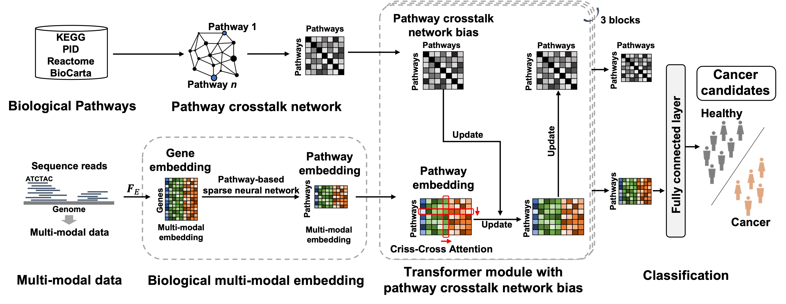

# Pathformer

[](https://www.python.org/) 

## Pathformer: a biological pathway informed Transformer for disease diagnosis and prognosis using multi-omics data

Integrating multi-omics data offers a more comprehensive view of gene regulation, which would be helpful in achieving accurate diagnosis of diseases like cancer. To improve the accuracy of disease diagnosis and prognosis, we developed Pathformer, a multi-omics integration method for both tissue and liquid biopsy data. Pathformer is based on a biological pathway informed Transformer model, which embeds multi-omics input at gene level and pathway level with a compacted novel vector. It performs multiple classification tasks with high accuracy and biological interpretability. Pathformer leverages criss-cross attention mechanism to capture crosstalk between different biological pathways and between different modalities (i.e., multi-omics). It also utilizes SHapley Additive Explanation method to reveal key pathways, genes, and regulatory mechanisms.Pathformer performs classification tasks with high accuracy and biological interpretability, which can be applied to the liquid biopsy data for noninvasive cancer diagnosis.





## Getting Started

To get a local copy up and running, follow these simple steps

### Prerequisites

python 3.6.9, check environments.yml for list of needed packages

### Installation

1.Clone the repo

```git clone https://github.com/lulab/Pathformer.git```

2.Create conda environment

```conda env create --name Pathformer --file=environment.yml```

## Usage

### 1.Activate the created conda environment

```source activate Pathformer```

### 2.Data preprocessing

Through benchmark studies on 20 TCGA datasets, we demonstrated the superior performance and interpretability of Pathformer on various cancer classification tasks, compared to 18 other integration models. Furthermore, we applied Pathformer to liquid biopsy multi-modal data integration with high accuracy in cancer diagnosis.

In **```data_preprocessing_TCGA```** folder, we provide TCGA data downloading and preprocessing methods. Here we take the breast cancer dataset as an example. More details see README in **```data_preprocessing_TCGA```** folder.

In **```data_preprocessing_cfRNA```** folder, we provide liquid biopsy data preprocessing methods. Here we collected two types of body fluid datasets: the plasma dataset and the platelet dataset. More details see README in **```data_preprocessing_cfRNA```** folder.

### 3.Model training and test.

For model training and test, we divided the labeled dataset into the train set (80%) and the test set (20%) hierarchically. Then, we used validation set (20% of training set) for model early stopping and hyperparameter optimizatio. 

#### 3.1 Examples of Pathformer model training for breast cancer high- and low-risk survival classification

```
cd Pathformer_code
python3 Pathformer_main.py \
--modal_all_path ../Result/BRCA_survival/modal_type_all.txt \
--modal_select_path ../Result/BRCA_survival/modal_type_all.txt \
--gene_all ../reference/gene_all.txt \
--gene_select ../reference/Pathformer_select_gene.txt \
--pathway_gene_w ../reference/Pathformer_pathway_gene_weight.npy \
--pathway_crosstalk_network  ../reference/Pathformer_pathway_crosstalk_network_matrix.npy \
--data_path ../data_TCGA/3.data_gene_embedding/merge/merge_data_survival/data_all.npy \
--label_path ../data_TCGA/2.sample_id/sample_cross_survival.txt \
--save_path ../Result/BRCA_survival/ \
--dataset 1 \
--model_name BRCA_survival \
--model_save True \
--batch_size 16 \
--gradient_num 3 \
--epoch_num 2000 \
--early_stopping_type f1_macro_2 \
--patience 10 \
--delta 1e-2 \
--stop_epoch 0 \
--test_each_epoch_no 1 \
--depth 3 \
--heads  8 \
--dim_head 32 \
--beta 1 \
--attn_dropout 0.2 \
--ff_dropout 0.2 \
--classifier_dropout 0.3 \
--lr_max 1e-5 \
--lr_min 1e-8
```
| parameter                 | help                                                                                      |
|---------------------------|-------------------------------------------------------------------------------------------|
| data_path                 | Input gene embedding data                                                                 |
| label_path                | Data labels and data partitioning information                                             |
| dataset                   | Dataset number in data partitioning                                                       |
| modal_all_path            | Description file path for all modal names in order of input data                          |
| modal_select_path         | Description file path for selected modal names as Pathformer input of input data          |
| gene_all                  | Description file path for all gene in order of input data                                 |
| gene_select               | Description file path for Pathformer's gene in order of input data                        |
| pathway_gene_w            | Corresponding relationship between genes and pathways                                     |
| pathway_crosstalk_network | Initial pathway crosstalk network                                                         |
| model_save                | Whether to store model files                                                              |
| model_name                | Model name                                                                                |
| batch_size                | Batch size                                                                                |
| gradient_num              | Gradient accumulation                                                                     |
| epoch_num                 | Maximum number of epoch                                                                   |
| stop_epoch                | Minimum number of epoch                                                                   |
| early_stopping_type       | Evaluation criteria of early stopping                                                     |
| patience                  | How long to wait after last time validation loss improved in early stopping               |
| delta                     | Minimum change in the monitored quantity to qualify as an improvement in early stopping   |
| test_each_epoch_no        | If there is a test dataset, whether to calculate the results of the test set of each epoch |
| depth                     | Number of Pathformer encoder layers                                                       |
| heads                     | Number of attention heads of Pathformer                                                   |
| dim_head                  | Size of attention heads of Pathformer                                                     |
| beta                      | constant coefficient for row-attention                                                    |
| attn_dropout              | Dropout probability of attention                                                          |
| ff_dropout                | Dropout probability of FeedForward layer                                                  |
| classifier_dropout        | Dropout probability of classification                                                     |
| lr_max                    | Maximum of learning rate                                                                  |
| lr_min                    | Minimum of learning rate                                                                  |

#### 3.2 Examples of Pathformer model test for breast cancer high- and low-risk survival classification

If you have test data of breast cancer that has been processed into a gene embedding matrix, such as data_TCGA/3.data_gene_embedding/merge/merge_data_survival/data_test.npy , you can use a trained model for prediction.

```
cd Pathformer_code
python3 Pathformer_predict.py \
--modal_all_path ../Result/BRCA_survival/modal_type_all.txt \
--modal_select_path ../Result/BRCA_survival/modal_type_all.txt \
--gene_all ../reference/gene_all.txt \
--gene_select ../reference/Pathformer_select_gene.txt \
--pathway_gene_w ../reference/Pathformer_pathway_gene_weight.npy \
--pathway_crosstalk_network  ../reference/Pathformer_pathway_crosstalk_network_matrix.npy \
--data_path ../data_TCGA/3.data_gene_embedding/merge/merge_data_survival/data_test.npy \
--label_path ../Result/BRCA_survival/label_test.txt \
--sample_name_path ../Result/BRCA_survival/samplename_test.txt \
--model_path ../Result/BRCA_survival/ckpt/BRCA_survival_best.pth \
--save_path ../Result/BRCA_survival/ \
--label_dim 2 \
--evaluate True \
--depth 3 \
--heads  8 \
--dim_head 32 \
--beta 1 \
--attn_dropout 0.2 \
--ff_dropout 0.2 \
--classifier_dropout 0.3
```
|  parameter   | help                                                                                                                                                |
|  ----  |-----------------------------------------------------------------------------------------------------------------------------------------------------|
| data_path  | Input gene embedding data of test dataset                                                                                                           |
| label_path  | Data labels of test data. If not, it is None                                                                                                        |
| sample_name_path  | Sample name of test data. If not, it is None                                                                                                        |
| modal_all_path  | Description file path for all modal names in order of input data                                                                                    |
| modal_select_path  | Description file path for selected modal names as Pathformer input of input data                                                                    |
| gene_all  | Description file path for all gene in order of input data                                                                                           |
| gene_select  | Description file path for Pathformer's gene in order of input data                                                                                  |
| pathway_gene_w  | Corresponding relationship between genes and pathways                                                                                               |
| pathway_crosstalk_network  | Initial pathway crosstalk network                                                                                                                   |
| model_path  | Path of trained model for prediction                                                                                                                |
| save_path  | Save Path of result                                                                                                                                 |
| label_dim  | Number of label categories                                                                                                                          |
| evaluate  | Whether to conduct a result evaluation, with evaluation indicators including AUC, macro-averaged F1 score, and average F1 score weighted by support |
| evaluate  | Whether to conduct a result evaluation, with evaluation indicators including AUC, macro-averaged F1 score, and average F1 score weighted by support |
| depth  | Number of Pathformer encoder layers, consistent with the trained model                                                                              |
| heads  | Number of attention heads of Pathformer, consistent with the trained model                                                                          |
| dim_head  | Size of attention heads of Pathformer, consistent with the trained model                                                                            |
| beta  | constant coefficient for row-attention, consistent with the trained model                                                                           |
| attn_dropout  | Dropout probability of attention, consistent with the trained model                                                                                 |
| ff_dropout  | Dropout probability of FeedForward layer, consistent with the trained model                                                                         |
| classifier_dropout  | Dropout probability of classification, consistent with the trained model                                                                            |

#### 3.2 Examples of Pathformer model test for the EV dataset classification

For liquid biopsy data,the training function is the same as TCGA data, but the parameter inputs are different. Here we take the plasma dataset as an example.

```
cd Pathformer_code
python3 Pathformer_main.py \
--modal_all_path ../Result/plasma/modal_type_all.txt \
--modal_select_path ../Result/plasma/modal_type_all.txt \
--gene_all ../reference/gene_mRNA_cfRNA.txt \
--gene_select ../reference/Pathformer_select_gene.txt \
--pathway_gene_w ../reference/Pathformer_pathway_gene_weight.npy \
--pathway_crosstalk_network  ../reference/Pathformer_pathway_crosstalk_network_matrix.npy \
--data_path ../data_cfRNA/3.data_gene_embedding/merge/plasma/data_all.npy \
--label_path ../data_cfRNA/2.sample_id/sample_cross_plasma.txt \
--save_path ../Result/plasma/ \
--dataset 1 \
--model_name plasma \
--model_save True \
--batch_size 8 \
--gradient_num 4 \
--epoch_num 2000 \
--early_stopping_type f1_macro_2 \
--patience 10 \
--delta 1e-2 \
--stop_epoch 100 \
--test_each_epoch_no 1 \
--depth 3 \
--heads  8 \
--dim_head 32 \
--beta 1 \
--attn_dropout 0.2 \
--ff_dropout 0.2 \
--classifier_dropout 0.3 \
--lr_max 1e-5 \
--lr_min 1e-8
```
The parameter description is the same as section 3.1.

### 4.Model interpretability.

To better understand Pathformer’s decisions, we increased the interpretability of Pathformer by calculating contributions of different modalities, important pathways and their key genes, and hub module of the updated pathway crosstalk network. The contributions of different modalities are calculated by averaging attention maps in row-attention. The important pathways and their key genes are defined by SHapley Additive exPlanations (SHAP value). The hub module of the updated pathway crosstalk network is screened by sub-network scores based on SHAP values of pathways.

Here we take breast cancer subtype classification as an example, and the calculation is as follows:
```
cd Pathformer_code
bash ../Pathformer_Interpretability/log_BRCA_survival.sh
```
More details see **```Pathformer_Interpretability```** folder.

## License and Disclaimer

This tool is for research purpose and not approved for clinical use.
The tool shall not be used for commercial purposes without permission.
