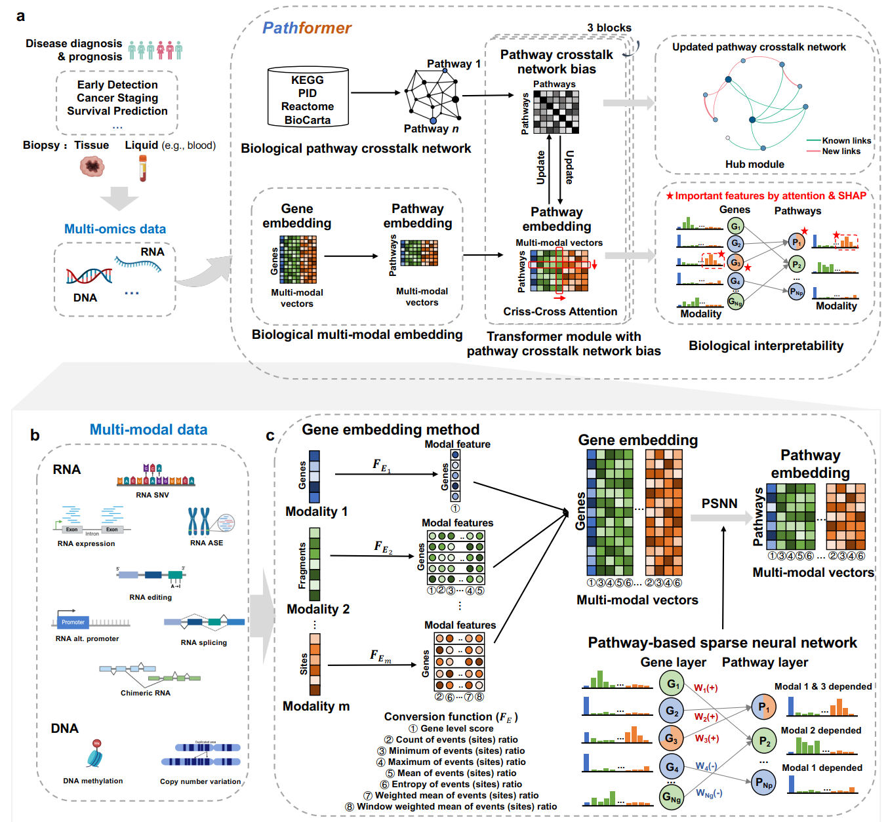

# Pathformer

[](https://www.python.org/) 

## Pathformer: biological pathway informed Transformer model integrating multi-modal data of cancer

Multi-modal biological data integration can provide comprehensive views of gene regulation and cell development. However, conventional integration methods rarely utilize prior biological knowledge and lack interpretability. To address these two challenges, we developed Pathformer, which is to our knowledge the first Transformer-based multi-modal integration model that incorporates biological pathway knowledge. Pathformer leverages criss-cross attention mechanism to capture crosstalk between different biological pathways and between different modalities (i.e., multi-omics). It also utilizes SHapley Additive Explanation method to reveal key pathways, genes, and regulatory mechanisms.Pathformer performs classification tasks with high accuracy and biological interpretability, which can be applied to the liquid biopsy data for noninvasive cancer diagnosis.





## Getting Started

To get a local copy up and running, follow these simple steps

### Prerequisites

python 3.6.9, check environments.yml for list of needed packages

### Installation

1.Clone the repo

```git clone https://github.com/lulab/Pathformer.git```

2.Create conda environment

```conda env create --name Pathformer --file=environment.yml```

## Usage

1.Activate the created conda environment

```source activate Pathformer```

2.Data download and preprocessing
Taking breast cancer as an example, we take RNA expression, DNA methylation and DNA CNV as input of Pathformers. Data preprocessing includes data download, sample filtering, statistical indicators of multi-modal calculation, and data merging.

1) Utilize codes of ```0.data_download``` to download the RNA expression, DNA metaphor and DNA CNV data of breast cancer in TCGA.

2) Utilize code of ```1.data_gene_embedding```to calculate different statistical indicators of different modalities.

```1.1.DNA_methylation_promoterid.py```:Correspond the promoter ID to the gene ID.
```1.2.DNA_methylation.py```:Calculate count of DNA methylation on gene body, maximum of DNA methylation on gene body, minimum of DNA methylation on gene body, and mean of DNA methylation on gene body.
```1.3.DNA_methylation_promoter.py```:Calculate count of DNA methylation on gene promoter, maximum of DNA methylation on gene promoter, minimum of DNA methylation on gene promoter, and mean of DNA methylation on gene promoter.
```2.1.CNV_id.py```:Correspond the CNV ID to the gene ID.
```2.2.CNV_data.py```:Calculate count of DNA CNV,gene level score of DNA CNV.
```2.3.CNV_data_merge.py```:Calculate maximum of DNA CNV, minimum of DNA CNV, and mean of DNA CNV.

3) Utilize code of ```1.data_gene_embedding``` for sample filtering.
```3.1.sample_all_filter.py``` and ```3.1.sample_all_filter_log.sh``:Filter samples containing both RNA expression, DNA methylation, and DNA CNV.
```3.2.sample_subtype.py```:Filter samples with breast cancer subtype label and give the label value.
```3.3.sample_stage.py```:Filter samples with breast cancer stage label and give the label value.
```3.4.sample_survival.py```:Filter samples with breast cancer survival label and give the label value.
```4.data_gene_embedding.py``` and ```4.data_gene_embedding.sh```:Organize statistical indicators of multi-modal data for filtered samples.

4) Utilize code of ```2.data_preprocessing``` for data merging.
```3.1.data_merge.py``` and ```3.1.data_merge.sh```:Merge data into gene embedding data and save it as data_all.npy。

3.Model training and test.
For model training and test, we divided the labeled dataset into the discovery set (75%) and the validation set (25%) hierarchically. We divided the discovery set into the training set (75%) and the test set (25%) hierarchically, and used the macro-averaged F1 score of the test set as the criterion for stopping training. 

```4.Pathformer/Pathformer.py```:Pathformer model.
```4.Pathformer/Pathformer_main.py```:Training and test of Pathformer for classification tasks.
